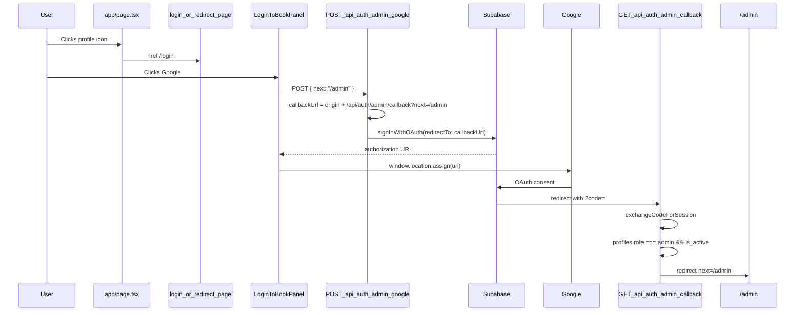

# Use NEXT_PUBLIC_SITE_URL for OAuth redirects

## Current auth architecture

The three pages you listed are **UI entry points only**; they do not build redirect URLs themselves.




| File                                                                           | Role                                                                                                                                                                                          |
| ------------------------------------------------------------------------------ | --------------------------------------------------------------------------------------------------------------------------------------------------------------------------------------------- |
| `[app/page.tsx](app/page.tsx)`                                                 | Public landing; links to `/login` only (no auth logic).                                                                                                                                       |
| `[app/login/page.tsx](app/login/page.tsx)`                                     | Admin login shell: `oauthNext="/admin"`, `googleEndpoint="/api/auth/admin/google"`, maps `auth_error` query to user-facing messages.                                                          |
| `[app/login/redirect/page.tsx](app/login/redirect/page.tsx)`                   | Same admin OAuth wiring as `/login`; declares booking-related `searchParams` but does **not** pass them into OAuth `next` today (unchanged by this fix).                                      |
| `[components/LoginToBookPanel.tsx](components/LoginToBookPanel.tsx)`           | Client: `POST` to google route, then `window.location.assign(data.url)`.                                                                                                                      |
| `[app/api/auth/admin/google/route.ts](app/api/auth/admin/google/route.ts)`     | Builds `redirectTo` for Supabase OAuth.                                                                                                                                                       |
| `[app/api/auth/admin/callback/route.ts](app/api/auth/admin/callback/route.ts)` | Exchanges code, enforces **existing** admin gate (`profiles.role === "admin"` + `is_active`), syncs profile, redirects to `next` (default `/` via `safeNextPath`, login pages pass `/admin`). |


**Important:** `[lib/auth/request-origin.ts](lib/auth/request-origin.ts)` already *intends* to use `.env`:

```6:9:lib/auth/request-origin.ts
export function getRequestOrigin(request: NextRequest): string {
  const fromEnv = process.env.NEXT_PUBLIC_SITE_URL?.replace(/\/$/, "");
  if (fromEnv) return fromEnv;
  return request.nextUrl.origin;
}
```

Both OAuth routes call this helper. So if you still see Supabase-dashboard **Site URL** behavior, typical causes are:

1. `**NEXT_PUBLIC_SITE_URL` empty at build/runtime** — Next inlines `NEXT_PUBLIC_*` at build time; if unset, `fromEnv` is falsy and code falls back to `request.nextUrl.origin` (the host of the incoming request).
2. **Supabase rejects `redirectTo`** — If `{NEXT_PUBLIC_SITE_URL}/api/auth/admin/callback` is not in Supabase **Redirect URLs**, Supabase falls back to the dashboard **Site URL** (this is Supabase-side, not fixable purely in app code).
3. `**AUTH_REDIRECT_ALLOWLIST` in `[.env](.env)` is unused** — no runtime guard that env and Supabase config stay aligned.

The login pages themselves need **no URL changes** for this task.

---

## What to change (minimal, non-breaking)

### 1. Harden site URL resolution (core fix)

Refactor `[lib/auth/request-origin.ts](lib/auth/request-origin.ts)` (rename optional: `getSiteUrl`) to:

- **Always prefer** trimmed `process.env.NEXT_PUBLIC_SITE_URL` (strip trailing slash).
- **Optional validation** against `AUTH_REDIRECT_ALLOWLIST` (comma-separated origins already in `.env`). If allowlist is set and env URL is not listed, throw or return 500 from OAuth routes with a clear log message (prevents misconfigured deploys).
- **Restrict fallback** to `request.nextUrl.origin` to **development only** (`NODE_ENV === "development"`), so production never silently uses request host instead of `.env`.
- **Production:** if `NEXT_PUBLIC_SITE_URL` is missing, fail fast in google/callback routes (clear error) rather than guessing origin.

This preserves local dev ergonomics while making production behavior explicitly env-driven.

### 2. Centralize OAuth callback URL construction

Add a small helper in `lib/auth/` (e.g. `admin-oauth-urls.ts`):

```ts
export function getAdminOAuthCallbackUrl(origin: string, nextPath: string): string
```

Used by both:

- `[app/api/auth/admin/google/route.ts](app/api/auth/admin/google/route.ts)` — `redirectTo` in `signInWithOAuth`
- Optionally document/log the exact URL in dev for Supabase setup

Keeps google and callback routes consistent; **no change** to role checks, `ensureAdminProfile`, or `safeNextPath` behavior.

### 3. No changes to page components (unless you want later)

- `[app/page.tsx](app/page.tsx)`, `[app/login/page.tsx](app/login/page.tsx)`, `[app/login/redirect/page.tsx](app/login/redirect/page.tsx)`: leave as-is for this fix.
- Existing error codes (`admin_access_denied`, `admin_profile_sync_failed`) and redirects to `/login?auth_error=...` stay the same; only the **origin** prefix becomes env-backed.

### 4. Supabase dashboard (required companion step, not code)

After code change, for each environment set in `.env`:


| Setting                       | Value                                                                             |
| ----------------------------- | --------------------------------------------------------------------------------- |
| **Redirect URLs** (allowlist) | `{NEXT_PUBLIC_SITE_URL}/api/auth/admin/callback`                                  |
| **Site URL**                  | Can remain production canonical URL; app will pass explicit `redirectTo` from env |


Supabase will continue to override redirects if the callback URL is **not** allowlisted—this is expected and must match `.env`.

### 5. Deployment / local dev checklist

- Set `NEXT_PUBLIC_SITE_URL` in hosting env (Vercel, etc.) to match that deployment’s public URL.
- **Restart dev server / rebuild** after changing `NEXT_PUBLIC_`* (Next does not hot-reload env into server bundles reliably).
- Keep `AUTH_REDIRECT_ALLOWLIST` in sync (e.g. `http://localhost:3000` for local, production URL for prod).

---

## What we explicitly will NOT change

- Admin authorization logic in callback (`profiles` role/active check, `signOut` on denial).
- `oauthNext="/admin"` on login pages.
- `LoginToBookPanel` client flow.
- Landing page content or `/login/redirect` booking params (separate feature).

---

## Verification plan

1. With `NEXT_PUBLIC_SITE_URL=http://localhost:3000`, start Google sign-in from `/login`; confirm network tab shows `redirect_to=http://localhost:3000/api/auth/admin/callback?next=%2Fadmin` in the Supabase authorize URL (not the Supabase dashboard Site URL host/path).
2. Sign in with a known admin email in `profiles`; land on `/admin` with session cookies set.
3. Sign in with a non-admin Google account; still redirected to `/login?auth_error=admin_access_denied` on **localhost origin** (not production Site URL).
4. Temporarily unset `NEXT_PUBLIC_SITE_URL` in production build; confirm OAuth routes error clearly instead of wrong redirect.
5. Regression: `safeNextPath` still blocks open redirects (`next` must be same-origin path like `/admin`).

